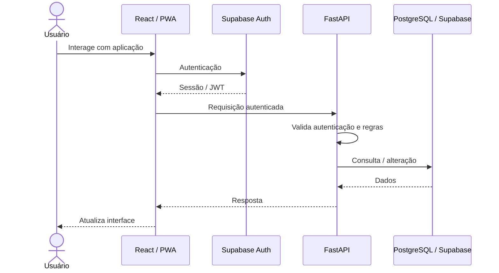
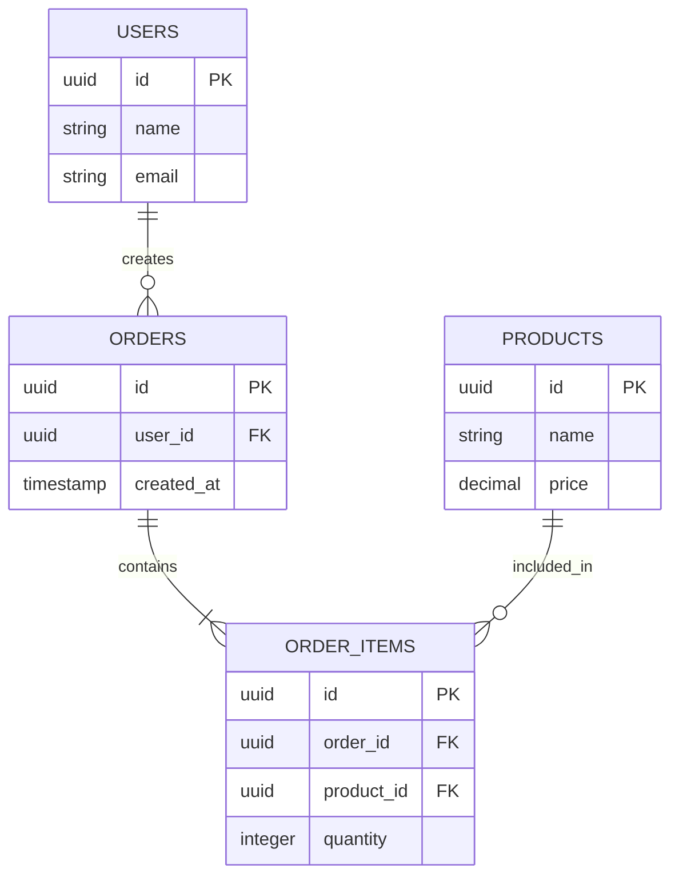

# Project Constitution

Este documento define as regras, restrições e decisões arquiteturais globais do projeto.

Estas regras se aplicam a **todas as funcionalidades, componentes, páginas, APIs, banco de dados e alterações realizadas no projeto**, salvo quando uma especificação formalmente declarar uma exceção.

Antes de implementar qualquer mudança, a IA deve consultar este documento e respeitar suas regras.

---

## 1. Princípios Fundamentais

### 1.1 Consistência antes de conveniência

Novas implementações devem seguir os padrões já estabelecidos no projeto.

Não criar uma nova abordagem arquitetural, estrutura de pastas, padrão de nomenclatura ou biblioteca quando já existir uma solução equivalente no projeto.

### 1.2 Reutilização antes de duplicação

Antes de criar:

* componente;
* hook;
* função utilitária;
* serviço;
* tipo/interface;
* regra de negócio;
* componente visual;

verificar se já existe uma implementação reutilizável.

Evitar duplicação de código e de regras.

### 1.3 Mudanças incrementais

Alterações devem ser feitas de forma incremental e compatível com a arquitetura existente.

Não realizar refatorações amplas ou mudanças arquiteturais sem necessidade explícita.

### 1.4 Especificações têm precedência local

Este documento define as regras globais.

Uma especificação de feature pode adicionar requisitos específicos, mas não deve violar estas regras sem declarar explicitamente uma exceção e sua justificativa.

---

# 2. Stack Oficial

A stack oficial do projeto é:

## Frontend

* React
* TypeScript
* SPA (Single Page Application)

## Backend

* Python
* FastAPI

## Autenticação

* Supabase Auth

## Banco de dados

* PostgreSQL disponibilizado pelo Supabase

## PWA

O frontend deve ser preparado como Progressive Web App (PWA), permitindo instalação e utilização com experiência semelhante à de um aplicativo.

### Regra

Não introduzir outra tecnologia principal que substitua uma das tecnologias acima sem decisão arquitetural explícita.

---

# 3. Arquitetura Geral

A aplicação deve seguir uma separação clara entre:

```text
Frontend (React)
        │
        │ HTTP / API
        ▼
Backend (FastAPI)
        │
        ├── regras de negócio
        ├── validações
        └── acesso a dados
                │
                ▼
        Supabase / PostgreSQL
```

A autenticação utiliza:

```text
React
  │
  ▼
Supabase Auth
  │
  ▼
JWT
  │
  ▼
FastAPI
  │
  └── valida e utiliza a identidade autenticada
```

O frontend não deve implementar regras de negócio que pertençam ao backend.

O backend deve ser considerado a autoridade para regras de negócio, permissões e validações de segurança.

---

# 4. Frontend

O frontend deve:

* utilizar React;
* utilizar TypeScript;
* funcionar como SPA;
* ser responsivo;
* funcionar adequadamente em desktop, tablet e celular;
* seguir o Design System definido em `sdd/ai-instructions/constitution/design-system.md`;
* documentar os componentes utilizando storybook
* atualizar o documento storybook-readme.md para explicar como ele funciona e como acessar o catálogo (incluído comando CLI que devem ser efetuados)
* reutilizar componentes existentes;
* manter separação adequada entre apresentação, estado e regras de negócio.

### 4.1 Responsividade

Toda nova interface deve considerar, no mínimo:

* desktop;
* tablet;
* celular.

Não implementar uma interface pensando exclusivamente em desktop e adaptá-la posteriormente.

### 4.2 Mobile-first quando apropriado

Quando não houver motivo contrário, componentes e layouts devem ser projetados considerando primeiro as restrições de telas pequenas.

---

# 5. Interface Mobile

A interface deve ser **finger-friendly**.

Elementos interativos devem possuir tamanho e espaçamento adequados para interação por toque.

Considerar especialmente:

* botões;
* links;
* inputs;
* selects;
* checkboxes;
* menus;
* tabs;
* ícones clicáveis;
* ações de navegação.

Evitar elementos interativos excessivamente pequenos ou próximos uns dos outros.

Interações que dependem exclusivamente de hover não podem ser necessárias para utilizar a aplicação.

---

# 6. PWA

O frontend deve possuir suporte a PWA.

A implementação deve considerar:

* Web App Manifest;
* ícone da aplicação;
* nome e identidade da aplicação;
* comportamento adequado quando instalada;
* viewport mobile;
* experiência semelhante à de aplicativo;
* service worker quando necessário;
* comportamento adequado em conexões instáveis, quando aplicável.

A experiência PWA não deve criar uma segunda arquitetura de frontend. Deve utilizar a mesma aplicação React.

---

# 7. Design System

O arquivo:

```text
sdd/ai-instructions/constitution/design-system.md
```

é a **fonte oficial das regras visuais do projeto**.

Toda nova interface deve respeitar o Design System existente.

Isso inclui, quando definidos:

* cores;
* tipografia;
* escala tipográfica;
* espaçamentos;
* grid;
* bordas;
* border-radius;
* sombras;
* componentes;
* estados;
* ícones;
* animações;
* breakpoints;
* princípios de layout;
* padrões de interação.

### Regra

Não criar estilos visuais arbitrários quando existir um token, componente ou padrão equivalente no Design System.

Antes de criar um novo padrão visual, verificar `sdd/ai-instructions/constitution/design-system.md`.

---

# 8. Estrutura de Pastas

A estrutura de pastas existente é considerada parte da arquitetura do projeto.

Antes de criar um arquivo ou diretório:

1. verificar a estrutura existente;
2. identificar o padrão utilizado;
3. colocar o novo arquivo no local correspondente;
4. manter a convenção de nomenclatura existente.

Não reorganizar a estrutura de pastas simplesmente para acomodar uma nova feature.

Não criar estruturas paralelas ou alternativas para resolver o mesmo problema.

### 8.1 Estrutura de documentação SDD

Os documentos de instruções, contexto, especificações e estado atual do sistema devem seguir a estrutura abaixo:

```text
sdd/
└── ai-instructions/
    ├── project-constitution.md
    │
    ├── constitution/
    │   ├── business-context.md
    │   └── design-system.md
    │
    ├── current-system/
    │   ├── backend.md
    │   ├── frontend.md
    │   └── database.md
    │
    └── specs/
        ├── 001-feature.md
        ├── 002-feature.md
        └── ...
```

Os arquivos e diretórios possuem as seguintes responsabilidades:

| Arquivo ou diretório               | Responsabilidade                                                                                                                                 |
| ---------------------------------- | ------------------------------------------------------------------------------------------------------------------------------------------------ |
| `constitution/business-context.md` | Apresentar o contexto de negócio do sistema, incluindo seu propósito, problema que resolve, objetivos, conceitos e regras de negócio relevantes. |
| `constitution/design-system.md`    | Definir a fonte de verdade do Design System, incluindo os padrões visuais e de experiência do usuário (UI/UX).                                   |
| `project-constitution.md`          | Definir as regras globais, restrições, decisões arquiteturais e princípios que devem ser respeitados durante o desenvolvimento.                  |
| `current-system/backend.md`        | Descrever tecnicamente o backend implementado e refletir continuamente seu estado atual.                                                         |
| `current-system/frontend.md`       | Descrever tecnicamente o frontend implementado, sua organização e refletir continuamente seu estado atual.                                       |
| `current-system/database.md`       | Descrever o banco de dados implementado, suas tabelas, colunas, tipos, relacionamentos e refletir continuamente seu estado atual.                |
| `specs/`                           | Armazenar as especificações das funcionalidades que deverão ser implementadas quando solicitadas.                                                |

### 8.2 Regra de compatibilidade

A estrutura existente do projeto deve ser inspecionada antes de qualquer criação ou alteração de arquivos.

Os documentos de referência descritos nesta seção devem permanecer em seus respectivos diretórios.

Caso a estrutura existente não seja suficiente para uma nova necessidade, primeiro avaliar se ela pode ser estendida mantendo o padrão existente.

Mudanças estruturais maiores devem ser explicitamente justificadas.

---

# 9. Backend

O backend deve utilizar FastAPI.

Responsabilidades do backend incluem:

* regras de negócio;
* validações;
* autorização;
* processamento de dados;
* integração com serviços externos;
* acesso ao banco;
* exposição das APIs.

O backend não deve depender da implementação visual do frontend.

Endpoints devem possuir:

* responsabilidade clara;
* nomes consistentes;
* validação de entrada;
* tratamento adequado de erros;
* respostas estruturadas;
* autenticação/autorização quando necessária.

Os detalhes técnicos e a organização do backend devem ser documentados em `sdd/ai-instructions/current-system/backend.md`, que deve refletir o estado efetivamente implementado.

---

# 10. Autenticação e Autorização

A autenticação da aplicação utiliza **Supabase Auth**.

O frontend pode interagir diretamente com o Supabase Auth para operações de autenticação, como:

* login;
* logout;
* recuperação de sessão;
* renovação de sessão;
* cadastro, quando aplicável.

Quando uma requisição autenticada chegar ao FastAPI, o backend deve validar o token de autenticação antes de executar operações protegidas.

A autenticação não deve ser duplicada em outro mecanismo sem decisão arquitetural explícita.

### Segurança

Nunca confiar exclusivamente em informações enviadas pelo frontend para determinar:

* identidade;
* permissões;
* ownership de recursos;
* acesso a dados;
* autorização de operações.

Essas informações devem ser verificadas no backend.

---

# 11. Banco de Dados

O banco oficial é PostgreSQL através do Supabase.

Antes de criar uma nova tabela:

* verificar tabelas existentes;
* verificar relacionamentos;
* verificar se a informação já existe;
* evitar duplicação de dados;
* seguir as convenções existentes.

Alterações no schema devem ser tratadas como mudanças estruturais e documentadas conforme o padrão de migrations adotado pelo projeto.

O estado atual do banco de dados deve ser documentado em `sdd/ai-instructions/current-system/database.md`.

---

# 12. Estado e Dados

Distinguir claramente:

### Estado local

Informações específicas de um componente ou interação local.

### Estado de aplicação

Informações compartilhadas entre diferentes partes da aplicação.

### Estado remoto

Dados provenientes da API/backend/banco.

Não utilizar uma solução global de estado para dados que podem permanecer locais.

Evitar armazenar no frontend informações que podem ser obtidas de forma confiável a partir da fonte oficial.

---

# 13. Componentes

Componentes devem possuir responsabilidade clara.

Preferir:

```text
componentes pequenos
        +
composição
        +
reutilização
```

em vez de componentes monolíticos.

Um componente não deve acumular indiscriminadamente:

* apresentação;
* chamadas de API;
* regras de negócio;
* gerenciamento complexo de estado;
* validações;
* transformação de dados.

Separar responsabilidades quando a complexidade justificar.

---

# 14. Nomenclatura

Manter as convenções já existentes no projeto.

Antes de criar uma nova convenção:

1. verificar arquivos existentes;
2. verificar componentes semelhantes;
3. verificar nomenclatura utilizada nas APIs;
4. seguir o padrão predominante.

Não misturar convenções sem necessidade.

---

# 15. Dependências

Antes de adicionar uma nova biblioteca:

1. verificar se o projeto já possui uma solução equivalente;
2. verificar se a funcionalidade pode ser implementada utilizando a stack existente;
3. avaliar o impacto da nova dependência;
4. evitar dependências desnecessárias.

Não adicionar bibliotecas apenas por conveniência quando a funcionalidade já estiver disponível nas tecnologias existentes.

---

# 16. Qualidade de Código

O código deve priorizar:

* legibilidade;
* simplicidade;
* manutenção;
* reutilização;
* tipagem;
* baixo acoplamento;
* alta coesão;
* tratamento explícito de erros.

Evitar abstrações prematuras.

Não criar abstrações genéricas apenas pela possibilidade de reutilização futura.

---

# 17. Segurança

Nunca:

* expor secrets no frontend;
* armazenar secrets em código-fonte;
* confiar em dados do cliente sem validação;
* ignorar autorização no backend;
* retornar dados sensíveis desnecessariamente;
* implementar autenticação paralela sem necessidade.

Variáveis sensíveis devem utilizar mecanismos apropriados de configuração e ambiente.

---

# 18. Documentação

Decisões arquiteturais importantes devem ser documentadas.

A documentação deve permanecer coerente com a implementação.

Quando uma mudança tornar uma regra documentada obsoleta, a documentação correspondente deve ser atualizada.

Documentação importante do projeto deve ser considerada parte do código e mantida junto ao repositório.

---

# 19. Processo de Implementação

Antes de implementar uma nova feature, a IA deve:

1. Ler `sdd/ai-instructions/project-constitution.md`.
2. Ler `sdd/ai-instructions/constitution/business-context.md` para compreender o contexto de negócio.
3. Ler `sdd/ai-instructions/constitution/design-system.md` para compreender as regras visuais e de UX.
4. Inspecionar a estrutura atual do projeto.
5. Consultar os documentos de estado atual relevantes em `sdd/ai-instructions/current-system/`.
6. Identificar componentes e serviços reutilizáveis.
7. Identificar padrões existentes semelhantes.
8. Ler a especificação da feature correspondente em `sdd/ai-instructions/specs/`.
9. Implementar respeitando as regras globais.
10. Verificar responsividade.
11. Verificar experiência mobile/finger-friendly.
12. Verificar consistência visual com o Design System.
13. Verificar se a implementação introduziu duplicação ou inconsistência arquitetural.
14. Atualizar os documentos técnicos afetados para refletir o estado efetivamente implementado.

---

# 20. Regra de Não-Regressão

Uma nova implementação não deve quebrar deliberadamente padrões existentes para facilitar uma feature específica.

Ao finalizar uma alteração, verificar:

* funcionalidades existentes;
* rotas;
* autenticação;
* responsividade;
* componentes compartilhados;
* Design System;
* estrutura de pastas;
* contratos da API;
* banco de dados.

---

# 21. Hierarquia das Fontes de Verdade

Em caso de dúvida, utilizar a seguinte hierarquia:

```text
1. Código e arquitetura existente
2. project-constitution.md
3. business-context.md
4. design-system.md
5. Especificação da feature
6. Documentação do estado atual do sistema
7. Convenções gerais da stack
8. Preferência pessoal da IA
```

Quando houver conflito entre uma especificação de feature e uma regra global, a IA deve identificar o conflito antes de implementar.

Não alterar silenciosamente uma regra global para atender uma feature.

Os documentos de estado atual descrevem a implementação existente e devem ser consultados para compreender a arquitetura e os padrões efetivamente adotados. Eles não substituem as regras globais nem as especificações de funcionalidades.

---

# 22. Regra Final

O objetivo não é apenas fazer a feature funcionar.

Toda implementação deve preservar:

**coerência arquitetural + consistência visual + segurança + responsividade + manutenibilidade.**

Quando uma solução funcionar tecnicamente, mas violar os padrões existentes do projeto, deve-se preferir uma solução que mantenha a coerência global da aplicação.

---

# 23. Documentação Técnica Viva

O projeto deve possuir documentos técnicos complementares, organizados de acordo com a estrutura definida na Seção 8.

Esses documentos devem ser considerados **documentação técnica viva do projeto**.

Eles não representam apenas uma documentação inicial ou planejada. Devem refletir o **estado atual e efetivamente implementado da aplicação**, com exceção dos documentos de contexto, regras globais e especificações, que possuem finalidades próprias.

## 23.1 Estado inicial

Quando uma nova aplicação ou módulo for criado, os documentos técnicos podem inicialmente conter apenas a estrutura básica e as informações conhecidas naquele momento.

À medida que funcionalidades, tabelas, endpoints, componentes e demais elementos forem implementados, os documentos correspondentes devem ser atualizados.

Não documentar como implementado algo que ainda não existe no código.

---

## 23.2 Contexto de negócio — business-context.md

O arquivo `sdd/ai-instructions/constitution/business-context.md` deve apresentar o contexto de negócio do sistema.

Deve conter, conforme aplicável:

* propósito da aplicação;
* problema que a aplicação busca resolver;
* objetivos de negócio;
* público-alvo;
* principais usuários e seus papéis;
* processos de negócio;
* conceitos e terminologias do domínio;
* regras de negócio relevantes;
* restrições e premissas de negócio;
* indicadores ou resultados esperados.

Esse documento deve fornecer à IA o contexto necessário para compreender o motivo das funcionalidades e tomar decisões de implementação coerentes com os objetivos do sistema.

O documento deve ser atualizado quando houver mudanças relevantes no entendimento do negócio, nos objetivos, nos processos ou nas regras de negócio.

Ele não deve ser utilizado para documentar detalhes técnicos de implementação que pertençam aos documentos do estado atual do sistema.

---

## 23.3 Design System — design-system.md

O arquivo `sdd/ai-instructions/constitution/design-system.md` é a **fonte oficial das regras visuais e de experiência do usuário (UI/UX)**.

Deve conter, conforme aplicável:

* princípios de design;
* identidade visual;
* paleta de cores;
* tipografia;
* escala tipográfica;
* espaçamentos;
* grid;
* bordas e border-radius;
* sombras;
* componentes visuais;
* estados dos componentes;
* ícones;
* animações;
* breakpoints;
* padrões de layout;
* padrões de navegação;
* interações;
* comportamento responsivo;
* diretrizes de acessibilidade.

Toda nova interface deve respeitar o Design System existente.

Quando uma nova necessidade visual justificar a criação ou alteração de um padrão global, o Design System deve ser atualizado para refletir a decisão adotada.

Não criar estilos visuais arbitrários quando existir um token, componente ou padrão equivalente no Design System.

---

## 23.4 README.md

O arquivo `README.md` deve fornecer uma visão geral da aplicação.

Deve conter, conforme aplicável:

* objetivo da aplicação;
* problema que resolve;
* visão geral da arquitetura;
* principais tecnologias;
* principais módulos;
* como executar o projeto;
* estrutura geral do repositório;
* relação entre frontend, backend, autenticação e banco;
* informações importantes para novos desenvolvedores.

Também deve possuir um **diagrama de sequência em Mermaid** representando o fluxo principal da aplicação e o papel de cada parte.

Exemplo conceitual:



O diagrama deve ser atualizado caso a arquitetura ou o fluxo principal da aplicação seja alterado.

O README deve fornecer uma visão geral e direcionar o desenvolvedor aos documentos técnicos detalhados, evitando duplicar integralmente seu conteúdo.

---

## 23.5 database.md

O arquivo `sdd/ai-instructions/current-system/database.md` deve descrever o estado atual do banco de dados.

Deve conter, conforme aplicável:

* tecnologia do banco;
* tabelas existentes;
* colunas;
* tipos de dados;
* chaves primárias;
* chaves estrangeiras;
* constraints relevantes;
* índices relevantes;
* relacionamentos;
* regras importantes de integridade;
* informações relevantes sobre RLS, quando utilizadas;
* pequeno dicionário de dados.

O documento deve possuir uma representação visual dos relacionamentos utilizando **Mermaid ER Diagram**.

Exemplo:



Também deve existir um pequeno dicionário de dados descrevendo o significado das principais tabelas e campos.

O `database.md` deve refletir o **schema realmente existente**, e não um schema planejado.

Sempre que uma alteração estrutural do banco for implementada, a documentação deve ser atualizada.

---

## 23.6 backend.md

O arquivo `sdd/ai-instructions/current-system/backend.md` deve descrever tecnicamente o backend atual da aplicação.

Deve conter, conforme aplicável:

* tecnologia utilizada;
* versão relevante da stack;
* estrutura de pastas;
* arquitetura adotada;
* responsabilidades dos principais módulos;
* configuração;
* autenticação;
* autorização;
* comunicação com o banco;
* serviços;
* regras de negócio;
* integrações externas;
* tratamento de erros;
* variáveis de ambiente relevantes;
* convenções importantes;
* informações necessárias para executar e desenvolver o backend.

Deve indicar também como acessar a documentação automática do FastAPI.

Por padrão, devem ser documentados os endpoints de documentação disponíveis na aplicação, como:

```text
/docs
/redoc
/openapi.json
```

Quando a aplicação utilizar configurações diferentes dessas rotas, o `backend.md` deve indicar as rotas efetivamente utilizadas.

O documento não deve manter uma lista manual de endpoints como fonte primária quando essa informação já estiver disponível automaticamente pelo OpenAPI/FastAPI.

A documentação deve explicar **como descobrir e utilizar os endpoints implementados**, enquanto a documentação OpenAPI deve permanecer como fonte detalhada dos contratos atuais da API.

O `backend.md` deve ser atualizado sempre que houver mudanças relevantes na arquitetura, nos módulos, nas integrações, na autenticação ou nas demais características técnicas do backend.

---

## 23.7 frontend.md

O arquivo `sdd/ai-instructions/current-system/frontend.md` deve descrever tecnicamente o frontend atual.

Deve conter, conforme aplicável:

* tecnologia utilizada;
* arquitetura;
* estrutura de pastas;
* organização dos componentes;
* páginas e rotas;
* hooks;
* gerenciamento de estado;
* comunicação com APIs;
* autenticação;
* integração com Supabase;
* PWA;
* responsividade;
* organização dos assets;
* Design System;
* componentes compartilhados;
* convenções relevantes.

Deve explicar a finalidade das principais pastas e indicar onde novos elementos devem ser criados.

Exemplo:

```text
src/
├── app/
├── components/
├── features/
├── pages/
├── hooks/
├── services/
├── lib/
├── types/
├── assets/
└── styles/
```

A estrutura acima é apenas ilustrativa.

O documento deve sempre representar a **estrutura real existente no projeto**, não impor uma estrutura fictícia.

Caso a estrutura do frontend seja alterada, o `frontend.md` deve ser atualizado.

---

## 23.8 Especificações — specs/

A pasta `sdd/ai-instructions/specs/` deve armazenar as especificações das funcionalidades que serão implementadas quando solicitadas.

Ela poderá conter vários arquivos `.md`, cada um dedicado a uma funcionalidade, módulo ou conjunto coerente de requisitos.

Exemplo:

```text
sdd/
└── ai-instructions/
    └── specs/
        ├── 001-authentication.md
        ├── 002-user-management.md
        ├── 003-dashboard.md
        └── 004-reports.md
```

Cada especificação deve descrever os requisitos da funcionalidade correspondente, incluindo, conforme aplicável:

* objetivo;
* contexto;
* problema a ser resolvido;
* escopo;
* requisitos funcionais;
* requisitos não funcionais;
* regras de negócio;
* fluxos de usuário;
* comportamento esperado;
* critérios de aceitação;
* requisitos de interface;
* requisitos de integração;
* alterações esperadas no backend;
* alterações esperadas no banco de dados;
* dependências e restrições;
* cenários de teste.

As especificações devem respeitar as regras globais definidas neste documento, o contexto de negócio e o Design System.

As funcionalidades descritas nas especificações não devem ser consideradas implementadas apenas por estarem documentadas.

A implementação deve ocorrer quando for solicitada, seguindo o processo de desenvolvimento definido neste documento.

---

## 23.9 Regra de Sincronização da Documentação

Os documentos técnicos devem permanecer sincronizados com o código.

Uma alteração implementada que modifique significativamente:

* arquitetura;
* banco;
* tabelas;
* relacionamentos;
* endpoints;
* autenticação;
* estrutura de pastas;
* componentes;
* rotas;
* fluxo da aplicação;
* integrações;
* PWA;

deve resultar na atualização do documento correspondente.

A implementação e sua documentação devem ser tratadas como partes da mesma mudança.

### Regra prática

Sempre que uma feature for concluída, verificar:

```text
Feature implementada
        │
        ├── Mudou o contexto ou regras de negócio?
        │      └── atualizar business-context.md
        │
        ├── Mudou o banco?
        │      └── atualizar current-system/database.md
        │
        ├── Mudou backend/API?
        │      └── atualizar current-system/backend.md
        │
        ├── Mudou frontend?
        │      └── atualizar current-system/frontend.md
        │
        ├── Mudou arquitetura/fluxo geral?
        │      └── atualizar README.md
        │
        └── Mudou regra visual?
               └── atualizar constitution/design-system.md
```

Não é necessário alterar um documento quando a implementação não produzir nenhuma mudança relevante no conteúdo documentado por ele.

---

## 23.10 Documentação como Estado Atual

Os documentos `README.md`, `current-system/database.md`, `current-system/backend.md` e `current-system/frontend.md` devem ser interpretados como uma fotografia técnica atual da aplicação.

Portanto:

* não descrever funcionalidades futuras como existentes;
* não manter endpoints que foram removidos;
* não manter tabelas que não existem mais;
* não documentar componentes que foram removidos;
* não manter estruturas de pastas obsoletas;
* não registrar decisões que já não correspondem à implementação atual.

Quando uma funcionalidade for removida, sua documentação correspondente deve ser removida ou atualizada.

Quando uma arquitetura for alterada, a documentação anterior não deve permanecer como se ainda fosse válida.

O contexto de negócio e o Design System também devem ser mantidos atualizados, mas suas finalidades são distintas: o primeiro descreve o domínio e as regras do negócio; o segundo define os padrões visuais e de experiência do usuário.

---

## 23.11 Separação entre Especificação e Estado Implementado

Os documentos técnicos de estado atual (`README.md`, `current-system/database.md`, `current-system/backend.md` e `current-system/frontend.md`) descrevem o **estado atual implementado**.

Os arquivos em `specs/` descrevem os **requisitos e especificações das funcionalidades**.

O `business-context.md` descreve o contexto de negócio, e o `design-system.md` define as regras visuais e de experiência do usuário.

Portanto:

```text
business-context.md
        ↓
Por que a aplicação existe e quais problemas resolve

design-system.md
        ↓
Como a interface deve parecer e se comportar

project-constitution.md
        ↓
Quais regras globais devem ser respeitadas

specs/
        ↓
O que deve ser construído

código
        ↓
O que foi construído

current-system/
        ↓
Como o sistema atualmente construído está organizado

README.md
        ↓
Visão geral da aplicação e de sua arquitetura
```

Uma especificação pode descrever algo que ainda não foi implementado.

Os documentos técnicos de estado atual não devem.

Após a implementação de uma especificação, os documentos técnicos relevantes devem ser atualizados para refletir o novo estado da aplicação.

---

## 23.12 Atualização e Verificação

Ao finalizar uma implementação, a IA deve verificar se os documentos técnicos afetados foram atualizados e se continuam coerentes com o código.

Essa verificação deve considerar:

* correspondência entre documentação e implementação;
* consistência entre os documentos;
* ausência de informações obsoletas;
* atualização de diagramas;
* atualização de tabelas e dicionários de dados;
* atualização da estrutura de pastas documentada;
* coerência com as regras globais e com o Design System.

Caso não seja possível verificar alguma informação diretamente no código ou no ambiente disponível, a IA deve indicar essa limitação, em vez de presumir que a informação está correta.

A documentação deve ser atualizada de forma incremental, acompanhando a evolução da aplicação, sem exigir a reescrita completa dos documentos a cada nova funcionalidade.
